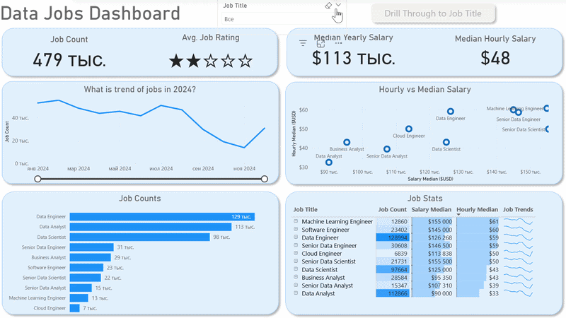
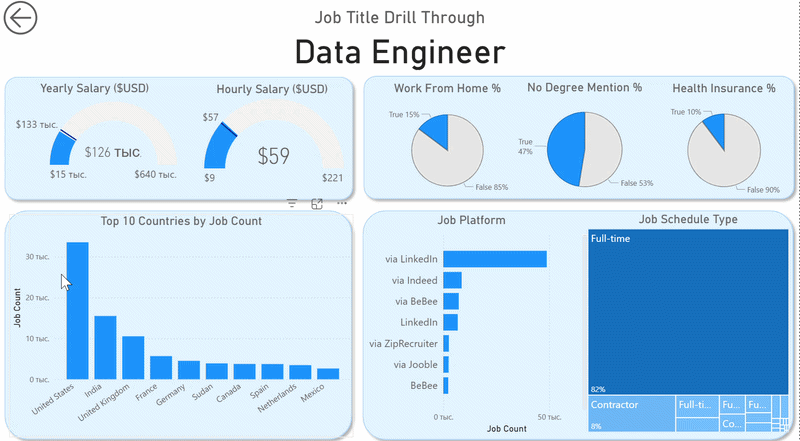

# Data Jobs Dashboard — аналитика вакансий в Power BI

  

**Данные взяты из открытого источника:** https://datanerd.tech/ (проект Luke Barousse, агрегация реальных вакансий в data-направлениях за 2024 год).

## Введение

Этот дашборд создан для **соискателей**, **тех, кто меняет направление карьеры** и **людей, рассматривающих переход в data-профессии**. Главная проблема, которую он решает — информация о рынке вакансий в data сильно разбросана и её сложно быстро осмыслить.

На основе реального датасета вакансий в data science и аналитике за 2024 год (названия позиций, зарплаты, локации и другие характеристики) проект даёт удобный единый интерфейс для изучения трендов рынка и уровня компенсаций.

### Файл дашборда

Файл отчёта доступен здесь: [`Data_Jobs_Dashboard.pbix`](Data_Jobs_Dashboard.pbix)

## Продемонстрированные навыки

В процессе создания были отработаны ключевые возможности Power BI:

- **Implicit Measures** — написание мер для ключевых метрик и KPI: `Median Yearly Salary`, `Job Count` и др.
- **Основные типы графиков** — Column, Bar, Line, Area Charts для сравнения количества вакансий и динамики во времени
- **KPI и табличные представления** — Cards для важнейших цифр, Tables для детализированных и сортируемых данных
- **Дизайн дашборда** — создание интуитивно понятной и красивой структуры
- **Интерактивность отчёта**
  - **Slicers** — динамическая фильтрация по Job Title
  - **Buttons & Bookmarks** — удобная навигация между представлениями
  - **Drill-Through** — переход от общего обзора к детальному анализу конкретной позиции

---

## Обзор дашборда

Отчёт состоит из двух страниц — обзорной и детализирующей.

### Page 1: High-Level Market View

Это «центр управления» рынком data-вакансий. Здесь собраны главные KPI: общее количество вакансий, медианная зарплата, топ востребованных позиций — чтобы за 10–15 секунд понять текущую ситуацию на рынке.

### Page 2: Job Title Drill Through

Страница детализации. С главной страницы можно перейти на страницу с информацией по конкретной должности и увидеть:

- диапазон зарплат
- долю вакансий с remote / work-from-home
- топ платформ, где размещают вакансию
- топ 10 стран, где размещают вакансию

---

## Итог

Этот проект показывает, как с помощью Power BI можно превратить сырые данные о вакансиях в удобный и мощный инструмент для анализа рынка труда и планирования карьеры. Пользователь может фильтровать, выборочно исследовать и детально погружаться в данные, чтобы принимать более осознанные решения о своём профессиональном пути.
