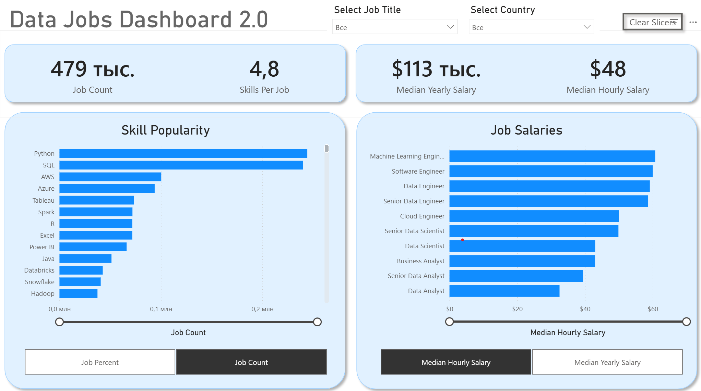

# Data Jobs Dashboard 2.0 — аналитика вакансий в Power BI

**Данные взяты из открытого источника:** https://datanerd.tech/ (агрегация реальных вакансий в data-направлениях за 2024 год).

## Введение

Навигация по рынку data-вакансий часто напоминает лабиринт — информация разбросана по разным источникам.  
Этот дашборд (версия 2.0) создан специально для **соискателей**, **тех, кто меняет карьерное направление**, и **специалистов, рассматривающих переход в data-сферу**. 

На основе реального датасета вакансий в data science и аналитике за 2024 год (должности, зарплаты, локации и другие детали) проект предлагает удобный **одностраничный интерфейс**, который позволяет быстро изучить ключевые тренды рынка и уровень компенсаций.

### Файл дашборда
Файл отчёта доступен здесь: [`Data_Jobs_Dashboard_2.0.pbix`](Data_Jobs_Dashboard_2.0.pbix)

## Продемонстрированные навыки

В этом проекте были активно применены важные возможности Power BI:

- **Дизайн дашборда** — создание интуитивно понятной и визуально привлекательной структуры отчёта  
- **Power Query ETL** — очистка, преобразование и подготовка данных  
- **Data Modeling** — построение эффективной модели данных с использованием принципов Star Schema
- **Field Parameters** — создание динамических параметров, позволяющих пользователю самостоятельно выбирать метрики для отображения на графиках  
- **Основы DAX** — создание расчётов и агрегатных мер для получения ключевых инсайтов  
- **Использованные визуализации:**
    - **Основные графики** — Column для сравнения и анализа трендов  
    - **Cards** — для выделения ключевых KPI  
- **Интерактивные возможности:**
    - **Slicers** — динамическая фильтрация данных пользователем  
   - **Field Parameters** — динамическое переключение метрик внутри графиков:
        - На графике **Skill Popularity**: выбор между **Job Percent** и **Job Count**
        - На графике **Job Salaries**: выбор между **Median Yearly Salary** и **Median Hourly Salary**

## Обзор дашборда (Version 2.0 - фокус на одной странице)

Вторая версия дашборда собрана в **одну компактную страницу**, которая даёт соискателям максимально важную информацию о рынке «с первого взгляда».

На  странице отображаются ключевые показатели:
- **Job Count** — общее количество вакансий  
- **Skills Per Job** — среднее количество навыков в одной вакансии  
- **Median Yearly Salary** и **Median Hourly Salary** — медианные зарплаты  

Особенностью дашборда являются два интерактивных графика с **Field Parameters**:
- **Skill Popularity** — популярность навыков с возможностью переключения между отображением в **процентах от вакансий (Job Percent)** и **количестве вакансий (Job Count)**
- **Job Salaries** — сравнение зарплат по должностям с возможностью переключения между **Median Yearly Salary** и **Median Hourly Salary**

Пользователь может гибко управлять данными с помощью слайсеров (**Select Job Title**, **Select Country**) и кнопки **Clear Slicers**.

---

## Итог

Обновлённый дашборд (Version 2.0) демонстрирует, как Power BI позволяет превратить большой объём данных о вакансиях в удобный инструмент для анализа рынка труда.  

Он помогает **соискателям**, **людям на этапе смены карьеры** и **специалистам, переходящим в data**, быстро фильтровать и изучать ключевые инсайты на одной странице, чтобы принимать более обоснованные решения о следующем шаге в карьере.